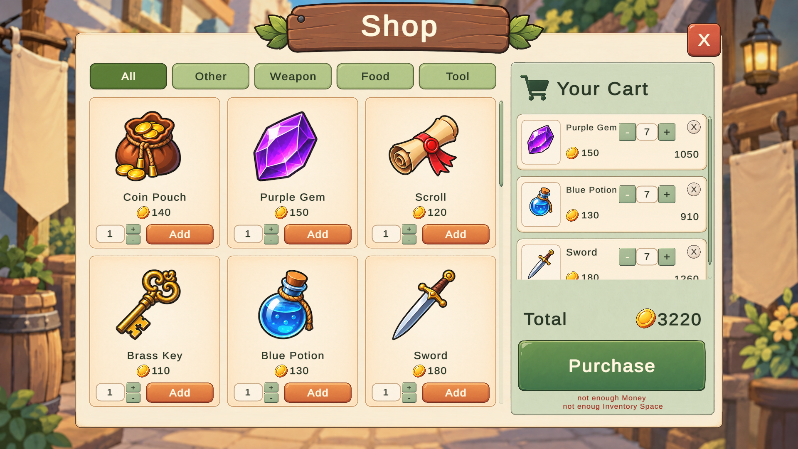
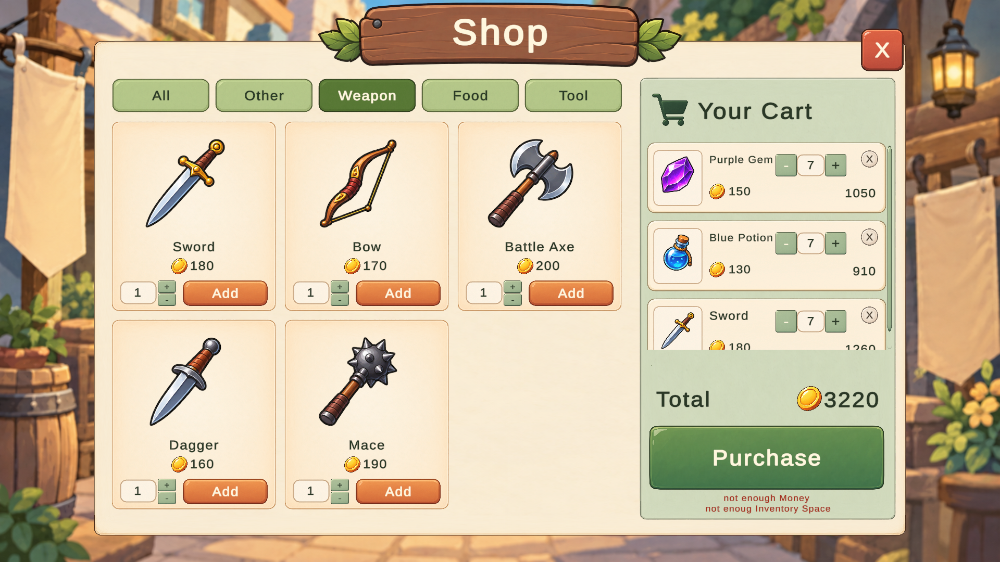
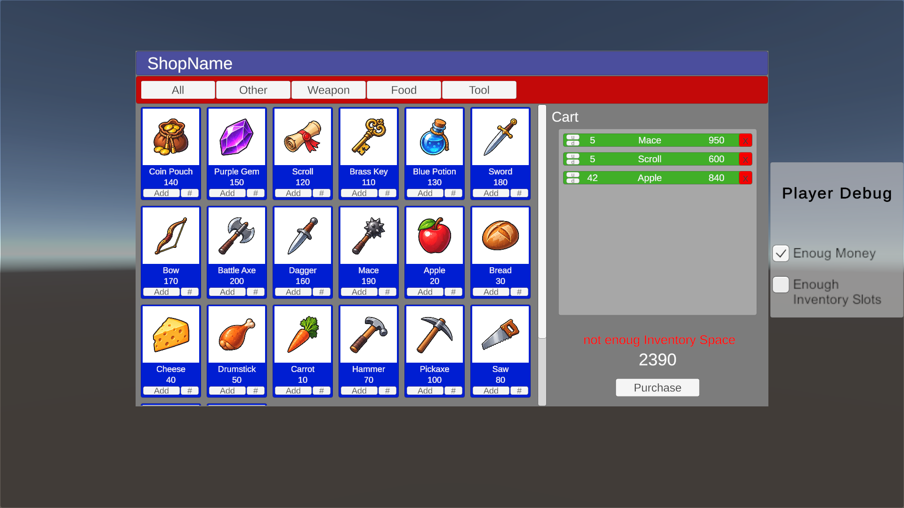
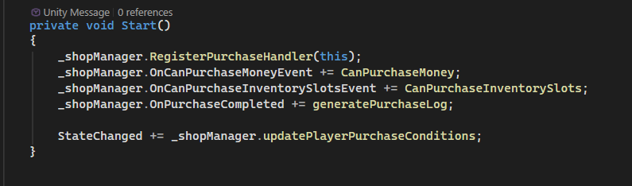
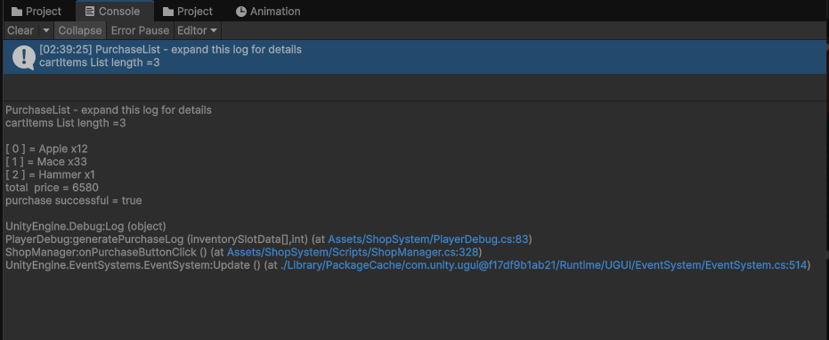

# Unity Shop System

A Unity shop UI with a shopping cart, category filters, ScriptableObject items, and an interface for connecting your own inventory and currency systems.

Includes a playable demo scene, UI prefabs, 20 sample items, and debug switches for testing purchase conditions. This repository is a Unity project, not a Unity Package Manager package.

## Screenshots

<p align="center">
  
  <br />
  <em>All items and shopping cart</em>
</p>

<p align="center">
  
  <br />
  <em>Weapon category filter</em>
</p>

<p align="center">
  
  <br />
  <em>Original UI and purchase-condition debugging</em>
</p>

<p align="center">
  
  <br />
  <em>Purchase-handler registration and event subscriptions</em>
</p>

<p align="center">
  
  <br />
  <em>Successful purchase in the Console</em>
</p>

## Features

- Item icons, names, prices, and configurable quantities.
- Category filters: Other, Weapon, Food, and Tool, You can easily Add more, and shop will work with them.
- Shopping cart with quantity controls and a running total.
- Money and inventory-capacity checks before checkout.
- One purchase handler per shop, with separate success notifications.
- ScriptableObject item definitions with per-item inventory stack sizes.
- Separate player debug logic and toggle bindings.

The demo simulates funds and inventory capacity. A complete wallet, inventory manager, persistence layer, and real transaction implementation are not included.

## Requirements

- **Unity 6000.3.11f1**, the version recorded in this project.
- Unity UI (uGUI) and TextMesh Pro for the interface.
- The sample project uses Universal Render Pipeline (URP).

Open the full project to restore its package dependencies from [`Packages/manifest.json`](Packages/manifest.json). The current shop source also imports `Unity.VisualScripting`, so keep that package installed when using the source as-is. Other Unity versions and render pipelines have not been verified here.

## Run the demo

1. Clone or download this repository.
2. In Unity Hub, add the repository folder as an existing project.
3. Open it with Unity 6000.3.11f1 and let the initial import finish.
4. Open [`ShopSystemSampleScene.unity`](Assets/ShopSystem/Scenes/ShopSystemSampleScene.unity).
5. Enter Play Mode and click **OpenShop**.
6. Use the player debug switches to simulate sufficient money and inventory space.
7. Add items, change quantities, filter categories, and purchase the cart. Successful demo purchases are logged to the Console.

## Project structure

| Path under `Assets/ShopSystem/` | Contents |
| --- | --- |
| `Scripts/` | Shop manager, item/cart views, category buttons, interfaces, and enums. |
| `Prefabs/` | Shop UI, player debug panel, and component prefabs. |
| `Scenes/` | Original and Illustrated Cream demo scenes. |
| `ScriptableObjects/` | `SOShopItemExample.cs` and sample item assets in `SO_ShopItemExample/`. |
| `Sprites/` | Shared sample item icons. |
| `InventorySystem(differentModule)/` | Shared item/slot data classes from a separate inventory module. |
| `Tests/Editor/` | Shop regression tests, prefab checks, and scene/UI integration tests. |
| `ShopDebug.cs` | Opens the demo shop with its assigned item list. |
| `PlayerDebug.cs` | Simulates player purchase conditions and handles debug purchases. |

## Create an item

1. In the Project window, choose **Create → Scriptable Objects → Inventory → ShopItem**.
2. Set its name, sprite, price (`Value`), category (`Type`), and maximum stack amount.
3. Add the asset to the `ShopDebug` item list or pass it to `ShopManager.openShop` from your own code.

`SOShopItemExample` extends `SOItemData` and implements:

- `IItemTradeable`: supplies the integer price through `Value`.
- `IItemType`: supplies the category through `Type`.

Custom item classes must extend `SOItemData` and implement `IItemTradeable`. `IItemType` is optional; items without it appear under Other. Use non-negative prices.

## Open and close a shop

Assign the shop manager and item assets in the Inspector. The optional close callback can restore player controls or other UI state.

```csharp
using UnityEngine;

public class OpenShopExample : MonoBehaviour
{
    [SerializeField] private ShopManager shop;
    [SerializeField] private SOItemData[] items;

    public void Open()
    {
        shop.openShop(items, () => Debug.Log("Shop closed"));
    }

    public void Close()
    {
        shop.closeShop();
    }
}
```

Opening a shop resets its cart. To clear the cart without closing the shop, call `clearCart()`.

## Connect your inventory and currency systems

Implement [`IShopPurchaseHandler`](Assets/ShopSystem/Scripts/Interfaces.cs) on your player or another component responsible for purchases. The current interface requires both methods:

```csharp
bool TryPurchase(inventorySlotData[] items, int totalPrice);
void onPurchase(inventorySlotData[] cartItems, int price);
```

`TryPurchase` must check current funds and inventory capacity, then commit the money deduction and item grant together. Return `true` only when the whole purchase succeeds. Return `false` without modifying money or inventory if it cannot complete.

Register the handler and optional condition/notification callbacks when your component becomes active, and remove them when it becomes inactive:

```csharp
// Inside your component implementing IShopPurchaseHandler:
private void OnEnable()
{
    shop.RegisterPurchaseHandler(this);
    shop.OnCanPurchaseMoneyEvent += CanAfford;
    shop.OnCanPurchaseInventorySlotsEvent += CanStore;
    shop.OnPurchaseCompleted += onPurchase;
}

private void OnDisable()
{
    if (shop == null)
        return;

    shop.UnregisterPurchaseHandler(this);
    shop.OnCanPurchaseMoneyEvent -= CanAfford;
    shop.OnCanPurchaseInventorySlotsEvent -= CanStore;
    shop.OnPurchaseCompleted -= onPurchase;
}
```

Here, `shop` is your assigned `ShopManager`, `CanAfford(int price)` returns whether the player has enough money, and `CanStore(inventorySlotData[] items)` returns whether the items fit. Implement these methods using your own systems.

- Only one purchase handler can be registered. Disable or remove the demo `PlayerDebug` before registering your own handler with the same shop.
- All subscribed condition callbacks must approve. Without a condition subscriber, that particular preview check defaults to approval; the transaction handler must still validate the purchase.
- Call `shop.updatePlayerPurchaseConditions()` when money or inventory space changes to refresh the displayed purchase conditions. Checkout also rechecks them when Buy is clicked.
- Empty carts and checkout without a handler are rejected. A failed purchase retains the cart; a successful purchase clears it.
- `OnPurchaseCompleted` is for sound, UI, quests, or logging after success. Do not deduct money or grant the same items again in a notification listener.
- **`onPurchase` is not called directly by `ShopManager`.** Subscribe it to `OnPurchaseCompleted`, as shown above, if you want it to receive the success notification. Registering the handler alone only connects `TryPurchase`.

The provided `PlayerDebug` is a simulation, not a real inventory adapter.

## Cart limits versus inventory stacks

**Max Quantity Per Item** on `ShopManager` limits the quantity of each item in the cart. The default serialized value is 999. Keep it positive.

`SOItemData.maxStackAmmount` describes how many items fit in one inventory stack. The sample items use 64 for Other/Food and 1 for Weapons/Tools. A cart row may represent multiple inventory stacks: purchasing three swords requires three slots.

Purchase callbacks receive one `inventorySlotData` entry per cart item, containing its total requested quantity. Your inventory implementation must distribute that quantity across stacks and check available capacity. See the [inventory module documentation](Assets/ShopSystem/InventorySystem%28differentModule%29/readMe.md) for the data helpers and their limitations.

## Use in an existing project

Start by running the included demo, then copy `Assets/ShopSystem` with its `.meta` files into your project. Ensure the UI, TextMesh Pro, and current source dependencies are available, and bring over any fonts or other assets referenced by the prefabs.

Use the sample scene as a wiring reference: the shop needs its view prefabs, content transforms, and text fields assigned. Add the shop UI to a Canvas with a working EventSystem, register your purchase handler, and open it with your item list. If your project already defines equivalent inventory data types, adapt these references before combining the modules to avoid duplicate class names.

## Tests and current limitations

Open **Window → General → Test Runner**, select **EditMode**, and run `ShopManagerRegressionTests`. The tests enter Play Mode to exercise the actual prefabs.

This is a development/debug project. The last full-suite run found quantity-related failures involving large typed quantities, cart-total integer overflow, and a zero configured quantity limit. The checkout and toggle-binding tests were subsequently verified separately. Review these edge cases before using the system with unrestricted quantities or large prices; the presence of tests does not mean the entire suite currently passes.

The current sample player also registers in `Start` and unregisters in `OnDisable`. If your integration enables and disables the player component, use the paired `OnEnable`/`OnDisable` registration pattern above.

## License

No `LICENSE` file is currently included in this repository.
